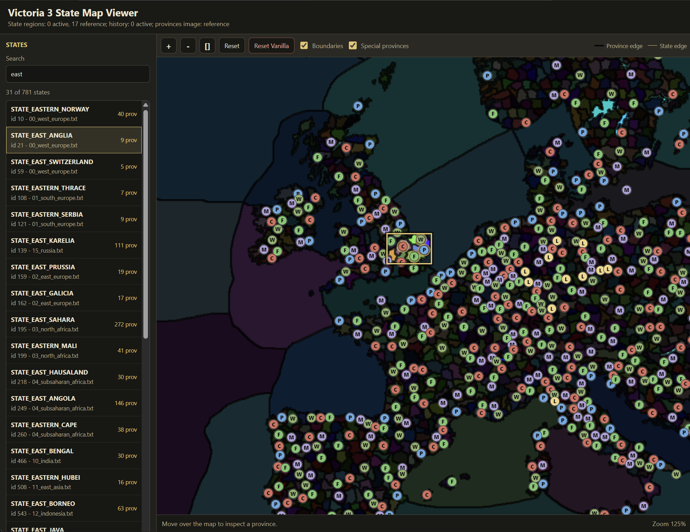

# Victoria 3 Lite Map Editor

A lightweight local web editor for Victoria 3 state-region province membership.

一个轻量级 Victoria 3 本地网页地图编辑器，用于编辑 state region 中包含的 province 地块。

This tool is designed for Victoria 3 1.13.7 and ships with vanilla 1.13.7 reference map data. It runs locally with Node.js, opens a browser UI, validates every province move, and writes safe Victoria 3 mod override files only when the draft is compliant.

本工具面向 Victoria 3 1.13.7，内置原版 1.13.7 地图参考数据。它使用 Node.js 在本地启动网页界面，校验每一次 province 移动，并且只有在草稿完全合规时才写入 Victoria 3 mod 覆盖文件。

Project version: 0.1.0. Supported game version: Victoria 3 1.13.7, checksum `f369`.

## Preview



## English

### What This Tool Does

Victoria 3 state appearance is largely controlled by province membership in:

```text
map_data/state_regions/*.txt
```

This editor lets you move existing province color IDs such as `xA1B2C3` between existing `STATE_*` blocks without repainting `provinces.png`.

It can:

- Read the active mod first, then fall back to bundled vanilla 1.13.7 reference files.
- Display all state regions and provinces on the vanilla province color map.
- Filter the map so selecting one state shows only that state and currently free provinces.
- Move provinces from a state into the free pool.
- Add free provinces into the selected state.
- Remove special province markers from a province, then add only legal missing markers back to provinces in the selected state.
- Automatically save after valid edits.
- Export saved map and history override files as a downloadable ZIP, and import the same ZIP structure back into the active mod with loading progress.
- Block saving when the draft contains duplicate provinces, non-lake free provinces, invalid special province fields, or unsafe paths.
- Reassign special province roles when possible, including `city`, `farm`, `mine`, `wood`, `port`, `center_province`, `prime_land`, and `impassable`.
- Sync initial ownership in `common/history/states/00_states.txt` when an owned province is moved between states.
- Reset generated state-region and history overrides back to the vanilla reference state.

It does not:

- Paint or create new province colors in `provinces.png`.
- Change terrain, heightmap, rivers, adjacencies, strategic regions, or spline networks.
- Create entirely new states with new IDs, localization, hub locators, or strategic-region membership.
- Guarantee compatibility with Victoria 3 versions other than the bundled vanilla 1.13.7 reference data.

### Required Environment

- Windows, macOS, or Linux.
- Node.js 18 or newer. Node.js 20+ is recommended.
- Victoria 3 1.13.7 if you want exact vanilla-reference compatibility.
- A local mod folder path that contains ASCII characters only.

Important: Victoria 3 can fail to load local mod files from paths containing non-ASCII characters. This is a known local mod problem documented by the Victoria 3 wiki. If your `Documents` path contains localized characters, accents, Cyrillic, CJK characters, or other non-ASCII text, use an ASCII-only game data path such as:

```text
C:/Users/YourName/Paradox Interactive/Victoria 3
```

You can change the local mod root by editing:

```text
Steam/steamapps/common/Victoria 3/launcher/launcher-settings.json
```

Change:

```json
"gameDataPath": "%USER_DOCUMENTS%/Paradox Interactive/Victoria 3"
```

To an ASCII-only path, for example:

```json
"gameDataPath": "C:/Users/YourName/Paradox Interactive/Victoria 3"
```

Restart the Paradox Launcher after changing this file.

### Download and Installation

Option A: Download ZIP from GitHub

1. Open the repository page.
2. Click `Code` -> `Download ZIP`.
3. Extract the ZIP.
4. Move the extracted folder into your Victoria 3 local mod directory.

Example final layout:

```text
C:/Users/YourName/Paradox Interactive/Victoria 3/mod/Victoria-3-lite-map-editor/
  .metadata/metadata.json
  start-editor.cmd
  README.md
  tools/
    state-map-viewer/
    vanilla_1_13_7_reference/
```

  If you are creating a new standalone local mod, copy the whole folder. If you are adding the editor to an existing mod, copy `tools/` and optionally `start-editor.cmd`, but keep that mod's existing `.metadata/metadata.json`. Overwriting an existing mod's metadata changes how the Paradox Launcher identifies the mod and can make the game load a different folder than the one the editor saves to.

  The packaged `.metadata/metadata.json` intentionally leaves `id` blank for local use. This avoids giving every pasted local copy the same global metadata id.

Option B: Clone with Git

```powershell
git clone https://github.com/STERILITZIA02/Victoria-3-lite-map-editor.git "C:\Users\YourName\Paradox Interactive\Victoria 3\mod\Victoria-3-lite-map-editor"
```

If you clone somewhere else, you can still run the editor by setting `VIC3_MOD_ROOT`, but the easiest workflow is to keep the repository folder directly inside the Victoria 3 `mod` folder.

### Start the Editor

From the mod/repository root, double-click:

```text
start-editor.cmd
```

Or run manually:

```powershell
cd "C:\Users\YourName\Paradox Interactive\Victoria 3\mod\Victoria-3-lite-map-editor\tools\state-map-viewer"
node server.js --open
```

Default URL:

```text
http://127.0.0.1:8793/
```

Use another port when needed:

```powershell
node server.js --open --port=8799
```

Advanced environment variables:

```powershell
$env:VIC3_MOD_ROOT="C:\Users\YourName\Paradox Interactive\Victoria 3\mod\MyMapMod"
$env:VIC3_REFERENCE_ROOT="C:\Users\YourName\Paradox Interactive\Victoria 3\mod\Victoria-3-lite-map-editor\tools\vanilla_1_13_7_reference\game"
node server.js --open --port=8799
```

`VIC3_MOD_ROOT` controls where generated mod files are written. `VIC3_REFERENCE_ROOT` controls which vanilla/reference data is used when the active mod has no override file yet.

### Editing Workflow

1. Start the editor.
2. Select a state from the left list or click a province on the map.
3. Check the top source line. It shows the exact mod folder being edited and whether known `content_load.json` files enable that same folder.
4. The map view will dim unrelated states and keep the selected state plus free provinces visible.
5. Click a province that belongs to the selected state and choose `Make province free`.
6. Click a province that belongs to the selected state and use the visible special marker buttons to remove existing markers or add legal missing markers.
7. Click a free province and choose `Add xRRGGBB to STATE_NAME`.
8. The editor validates the whole draft after the action.
9. If the draft is compliant, the tool saves automatically.
10. If the draft is invalid, the tool shows a blocking alert and does not write files.
11. Click `Export Map` to download the saved override files as a ZIP when you want to move or share the edited map.
12. Click `Import Map`, or drag the exported ZIP onto the editor, to replace matching saved override files in this mod.
13. Launch Victoria 3 with this mod enabled, then start a new game to verify the map.

A province cannot remain free unless it is a reserved lake province listed in `map_data/default.map`. Normal land provinces must belong to exactly one state before saving.

### Save Behavior

Victoria 3 treats same-path files as full-file overrides. For example, this mod file:

```text
map_data/state_regions/15_russia.txt
```

replaces the vanilla file:

```text
Victoria 3/game/map_data/state_regions/15_russia.txt
```

The editor handles that by copying the affected reference or active file and changing only the edited `STATE_*` blocks inside it. Unedited files are not generated.

When provinces with initial ownership move between states, the editor also writes:

```text
common/history/states/00_states.txt
```

This keeps `owned_provinces` aligned with the changed state-region membership and reduces state/history loading errors.

`Export Map` downloads the currently saved active overrides from the mod root:

```text
map_data/state_regions/*.txt
common/history/states/00_states.txt
```

It does not export the editor, bundled reference data, or unedited vanilla files.

`Import Map` accepts that same exported ZIP structure and writes only these paths back into the active mod root:

```text
map_data/state_regions/*.txt
common/history/states/00_states.txt
```

The importer rejects ZIP entries outside that whitelist, unsupported compressed/encrypted ZIP entries, duplicate paths, and imports that would leave invalid state-region or history ownership data. If validation fails, changed files are rolled back.

The import screen shows upload, validation, reload, map scan, and render progress. If an import fails, the editor keeps the previous map loaded.

### Reset Vanilla

Click `Reset Vanilla` to remove generated active overrides from the mod root:

```text
map_data/state_regions/*.txt
common/history/states/00_states.txt
```

The bundled reference data and the editor itself are not deleted. After reset, the editor falls back to vanilla 1.13.7 reference data.

Reset uses the same loading overlay while it sends the reset request, reloads the vanilla data, rescans the map image, and redraws the editor.

### File Formats Used by This Project

| Path or format | Read/write | Purpose |
| --- | --- | --- |
| `.metadata/metadata.json` | Read by launcher | Makes this folder visible as a local Victoria 3 mod. The packaged local metadata keeps `id` blank to avoid duplicate ids across pasted copies. |
| `map_data/state_regions/*.txt` | Read/write | Main state-region definitions. The editor moves province IDs in `provinces = { ... }`. |
| `common/history/states/00_states.txt` | Write when needed | Initial state ownership sync for moved owned provinces. |
| `map_data/provinces.png` | Read-only | RGB province color map used for visual picking and boundaries. |
| `map_data/default.map` | Read-only | Used to detect reserved lake provinces. |
| `tools/vanilla_1_13_7_reference/game` | Read-only reference | Bundled vanilla 1.13.7 fallback data. |
| `tools/state-map-viewer/server.js` | Local tool code | Node.js HTTP server and Victoria 3 file parser/writer. |
| `tools/state-map-viewer/public/*` | Local tool UI | Browser interface, map rendering, draft validation, and interactions. |

Victoria 3 script `.txt` files should be UTF-8. The bundled vanilla files are copied from the game reference; generated state-region files preserve the copied source text and only replace affected state blocks.

### Validation Rules

The editor blocks saving when any of these are true:

- The mod root path contains non-ASCII characters.
- A province appears in more than one state.
- A normal non-lake province is unassigned/free.
- A special province field points outside its state.
- A port replacement does not touch a sea state.
- A required special marker was deleted and has not been assigned back to a valid province.
- A province ID is malformed or unknown.
- A requested state name does not exist in the merged reference/active state list.

### Debugging

Start with the smallest loop:

1. Confirm the editor URL shows your active file counts.
2. Confirm the mod path is ASCII-only.
3. Confirm the save message names the expected files.
4. Check that generated files exist under your actual mod root.
5. Restart Victoria 3 completely.
6. Start a new game, not an old save, when testing state-region changes.
7. Check `error.log`, `game.log`, and `debug.log`.

Common problems:

| Symptom | Likely cause | Fix |
| --- | --- | --- |
| Save button/action is blocked with a path warning | The mod folder path contains non-ASCII characters | Move the mod or change `gameDataPath` to an ASCII-only path. |
| The browser shows old behavior after code updates | Old server process is still running | Close the terminal/server and restart `node server.js --open`. |
| `http://127.0.0.1:8793/` is already in use | Another viewer is running on that port | With the bundled server, the default start command automatically tries the next free port. You can also start with `node server.js --open --port=8799`. |
| Game still shows vanilla map | Launcher/playset points at a different copy of the mod | Check the editor top source line, `content_load.json`, and the active playset path in the launcher. |
| A copied editor saves but the game loads another local mod | Existing `.metadata` was overwritten, or the active playset still points at the old folder | Restore the intended mod metadata, then enable the same folder shown in the editor top source line. |
| Large white/blank state areas in game | A generated state-region override failed to load | Check non-ASCII path, malformed `.txt`, missing braces, or wrong game version reference. Use `Reset Vanilla` to recover. |
| Errors mention missing or invalid state regions | `map_data/state_regions/*.txt` override is malformed or unreadable | Reset, verify path, and retry with a smaller province move. |
| History/building/pop errors appear after state edits | Ownership/history no longer matches moved provinces | Keep `common/history/states/00_states.txt` generated by the editor, then start a new game. |
| Map edits do not appear in an existing save | The save already has initialized map/state data | Test with a new campaign after restarting the game. |

Useful checks on Windows PowerShell:

```powershell
# Syntax-check the local tool code
node --check .\tools\state-map-viewer\server.js
node --check .\tools\state-map-viewer\public\app.js

# Show generated override files
Get-ChildItem -Recurse .\map_data, .\common -File

# Confirm the active content load points at this mod
Get-Content "$env:USERPROFILE\Documents\Paradox Interactive\Victoria 3\content_load.json" -Raw
```

If the launcher was moved to an ASCII `gameDataPath`, logs may still be under the default Documents location on some setups. When in doubt, check both:

```text
%USERPROFILE%/Documents/Paradox Interactive/Victoria 3/logs
<your ASCII gameDataPath>/logs
```

### Updating the Reference Data for Another Game Version

This package bundles vanilla 1.13.7 data. For another Victoria 3 version, replace the reference folder with files from that exact version:

```text
tools/vanilla_1_13_7_reference/game/map_data/default.map
tools/vanilla_1_13_7_reference/game/map_data/provinces.png
tools/vanilla_1_13_7_reference/game/map_data/state_regions/*.txt
tools/vanilla_1_13_7_reference/game/common/history/states/00_states.txt
```

You may rename the folder, but then start the server with `VIC3_REFERENCE_ROOT` pointing at the new reference root.

### Repository Publishing Checklist

Before pushing a release:

```powershell
node --check .\tools\state-map-viewer\server.js
node --check .\tools\state-map-viewer\public\app.js
node .\tools\state-map-viewer\server.js --port=8799
```

Then open:

```text
http://127.0.0.1:8799/
```

Confirm:

- `schemaVersion` is current in `/api/map-data`.
- The page loads 781 vanilla states for the bundled 1.13.7 reference.
- A test edit writes the expected `map_data/state_regions/*.txt` file.
- `Reset Vanilla` removes generated overrides.
- No generated personal logs, saves, or cache files are committed.

Suggested Git commands:

```powershell
git init
git remote add origin https://github.com/STERILITZIA02/Victoria-3-lite-map-editor.git
git status
git add .
git commit -m "Initial Victoria 3 lite map editor release"
git push -u origin main
```

Only run the commit/push commands after you have reviewed the package contents.

---

## 中文

### 工具功能

Victoria 3 的 state 外观主要由 state region 中的 province 归属控制，相关文件位于：

```text
map_data/state_regions/*.txt
```

本编辑器可以在现有 `STATE_*` 区块之间移动现有 province 色值 ID，例如 `xA1B2C3`。它不会重新绘制 `provinces.png`，也不会创建新的 province 颜色。

它可以：

- 优先读取当前 mod 中的 active 文件，没有 active 文件时回退到内置原版 1.13.7 reference。
- 在原版 province 色彩图上显示所有 state region 和 province。
- 选择一个 state 后，只显示该 state 和当前 free province，其他 state 会被遮罩。
- 把 selected state 内的 province 移到 free pool。
- 把 free province 加入 selected state。
- 可以删除 province 上已有的特殊标记，并且只把合法、缺失的特殊标记手动加回 selected state 内的 province。
- 在修改合规时自动保存。
- 将已保存的地图和历史覆盖文件导出为可下载 ZIP，并用带进度条的导入流程把同结构 ZIP 写回当前 mod。
- 在草稿有重复 province、普通 province 未分配、special province 不合法、路径不安全等问题时阻止保存。
- 自动处理部分 special province 角色，包括 `city`、`farm`、`mine`、`wood`、`port`、`center_province`、`prime_land`、`impassable`。
- 当被移动 province 在开局历史中有 owner 时，同步写入 `common/history/states/00_states.txt`。
- 使用 `Reset Vanilla` 删除生成的覆盖文件，回到原版 reference 地图状态。

它不会：

- 修改或绘制 `provinces.png`。
- 修改 terrain、heightmap、rivers、adjacencies、strategic regions、spline networks。
- 创建全新的 state ID、localization、hub locator 或 strategic region 归属。
- 保证兼容 Victoria 3 1.13.7 以外的版本。

### 环境要求

- Windows、macOS 或 Linux。
- Node.js 18 或更高版本，推荐 Node.js 20+。
- 如果需要完全匹配内置 reference，请使用 Victoria 3 1.13.7。
- 本地 mod 路径必须只包含 ASCII 字符。

重要：Victoria 3 可能会显示本地 mod 已启用，但实际无法加载非 ASCII 路径下的某些文件。这是 Victoria 3 wiki 记录过的本地 mod 问题。如果你的 `Documents` 路径包含中文、重音字符、西里尔字符、日文、韩文或其他非 ASCII 字符，请使用纯 ASCII 路径，例如：

```text
C:/Users/YourName/Paradox Interactive/Victoria 3
```

可以修改这个文件来移动本地 mod 根目录：

```text
Steam/steamapps/common/Victoria 3/launcher/launcher-settings.json
```

把：

```json
"gameDataPath": "%USER_DOCUMENTS%/Paradox Interactive/Victoria 3"
```

改成类似：

```json
"gameDataPath": "C:/Users/YourName/Paradox Interactive/Victoria 3"
```

修改后请完全重启 Paradox Launcher。

### 下载和安装

方式 A：从 GitHub 下载 ZIP

1. 打开仓库页面。
2. 点击 `Code` -> `Download ZIP`。
3. 解压 ZIP。
4. 把解压后的文件夹移动到 Victoria 3 本地 mod 目录。

推荐最终结构：

```text
C:/Users/YourName/Paradox Interactive/Victoria 3/mod/Victoria-3-lite-map-editor/
  .metadata/metadata.json
  start-editor.cmd
  README.md
  tools/
    state-map-viewer/
    vanilla_1_13_7_reference/
```

  如果你要创建一个新的独立本地 mod，可以复制整个文件夹。如果你要把编辑器加入已有 mod，请复制 `tools/`，并按需要复制 `start-editor.cmd`，但保留该 mod 原本的 `.metadata/metadata.json`。覆盖已有 mod 的 metadata 会改变 Paradox Launcher 识别这个 mod 的方式，可能导致游戏加载的文件夹和编辑器保存的文件夹不是同一个。

  本包的 `.metadata/metadata.json` 会故意把 `id` 留空，适合本地复制使用。这样可以避免每个粘贴出来的本地副本都拥有同一个全局 metadata id。

方式 B：使用 Git clone

```powershell
git clone https://github.com/STERILITZIA02/Victoria-3-lite-map-editor.git "C:\Users\YourName\Paradox Interactive\Victoria 3\mod\Victoria-3-lite-map-editor"
```

如果 clone 到其他目录，也可以通过 `VIC3_MOD_ROOT` 指定实际写入的 mod 根目录；但最简单的使用方式是把整个仓库文件夹直接放在 Victoria 3 的 `mod` 目录下。

### 启动编辑器

在仓库/mod 根目录双击：

```text
start-editor.cmd
```

或者手动运行：

```powershell
cd "C:\Users\YourName\Paradox Interactive\Victoria 3\mod\Victoria-3-lite-map-editor\tools\state-map-viewer"
node server.js --open
```

默认地址：

```text
http://127.0.0.1:8793/
```

如果端口被占用，可以指定其他端口：

```powershell
node server.js --open --port=8799
```

高级环境变量：

```powershell
$env:VIC3_MOD_ROOT="C:\Users\YourName\Paradox Interactive\Victoria 3\mod\MyMapMod"
$env:VIC3_REFERENCE_ROOT="C:\Users\YourName\Paradox Interactive\Victoria 3\mod\Victoria-3-lite-map-editor\tools\vanilla_1_13_7_reference\game"
node server.js --open --port=8799
```

`VIC3_MOD_ROOT` 决定生成的 mod 文件写到哪里。`VIC3_REFERENCE_ROOT` 决定没有 active override 时使用哪一份原版/reference 数据。

### 编辑流程

1. 启动编辑器。
2. 从左侧 state 列表选择一个 state，或在地图上点击 province。
3. 先检查页面顶部 source line。它会显示正在编辑的准确 mod 文件夹，以及已知 `content_load.json` 是否启用了同一个文件夹。
4. 选择 state 后，地图会遮罩无关 state，只保留 selected state 和 free province。
5. 点击 selected state 内的 province，选择 `Make province free`。
6. 点击 selected state 内的 province，用界面上显示的特殊标记按钮删除已有标记，或添加当前合法且缺失的标记。
7. 点击 free province，选择 `Add xRRGGBB to STATE_NAME`。
8. 工具会在每次操作后校验整个草稿。
9. 如果草稿合规，会自动保存。
10. 如果草稿不合规，会弹出提示并阻止写入文件。
11. 需要移动或分享编辑完成的地图时，点击 `Export Map` 下载已保存覆盖文件 ZIP。
12. 点击 `Import Map`，或把导出的 ZIP 拖到编辑器窗口中，把匹配的覆盖文件替换回当前 mod。
13. 在 Victoria 3 launcher 中启用该 mod，完整重启游戏并开新档测试。

普通陆地 province 不能长期处于 free 状态。只有 `map_data/default.map` 中列出的 reserved lake province 可以保持未分配。所有普通 province 在保存前必须且只能属于一个 state。

### 保存行为

Victoria 3 对同路径同名文件采用整文件覆盖。例如 mod 中的：

```text
map_data/state_regions/15_russia.txt
```

会覆盖原版：

```text
Victoria 3/game/map_data/state_regions/15_russia.txt
```

因此本工具会复制受影响的 reference/active 文件，只替换其中被编辑的 `STATE_*` 区块，然后把整份文件写入当前 mod。没有被编辑到的 state-region 文件不会被生成。

`Export Map` 会从当前 mod root 下载已保存的 active override：

```text
map_data/state_regions/*.txt
common/history/states/00_states.txt
```

它不会导出编辑器、内置 reference 数据或未编辑的原版文件。

`Import Map` 接受同样结构的导出 ZIP，并且只会把以下路径写回当前 mod root：

```text
map_data/state_regions/*.txt
common/history/states/00_states.txt
```

导入器会拒绝白名单以外的 ZIP 条目、不支持的压缩/加密 ZIP 条目、重复路径，以及会导致 state-region 或 history ownership 数据无效的导入。校验失败时，已经写入的文件会回滚。

导入界面会显示上传、校验、重新加载、扫描地图、重新渲染的进度。导入失败时，编辑器会保留之前已经加载的地图。

当移动的 province 在开局历史中有 owner 时，工具还会写入：

```text
common/history/states/00_states.txt
```

这样可以让 `owned_provinces` 和新的 state-region 归属保持一致，减少 history/building/pop 加载错误。

### Reset Vanilla

点击 `Reset Vanilla` 会删除当前 mod 根目录下生成的 active override：

```text
map_data/state_regions/*.txt
common/history/states/00_states.txt
```

它不会删除工具本身，也不会删除内置 reference。Reset 后，编辑器会重新回退到原版 1.13.7 reference 地图。

Reset 也会显示加载遮罩和进度，覆盖发送请求、重新加载原版数据、扫描地图图像、重绘编辑器这些阶段。

### 本项目涉及的文件格式

| 路径或格式 | 读写方式 | 用途 |
| --- | --- | --- |
| `.metadata/metadata.json` | launcher 读取 | 让该文件夹显示为 Victoria 3 本地 mod。本包的本地 metadata 会把 `id` 留空，避免多个粘贴副本共享同一个 id。 |
| `map_data/state_regions/*.txt` | 读写 | state region 定义。工具移动 `provinces = { ... }` 中的 province ID。 |
| `common/history/states/00_states.txt` | 需要时写入 | 同步被移动 province 的开局 ownership。 |
| `map_data/provinces.png` | 只读 | RGB province 色彩图，用于地图点击、边界和可视化。 |
| `map_data/default.map` | 只读 | 用于识别 reserved lake province。 |
| `tools/vanilla_1_13_7_reference/game` | 只读 reference | 内置原版 1.13.7 fallback 数据。 |
| `tools/state-map-viewer/server.js` | 本地工具代码 | Node.js HTTP server、Vic3 文件解析和写入。 |
| `tools/state-map-viewer/public/*` | 本地网页 UI | 浏览器界面、地图渲染、草稿校验和交互。 |

Victoria 3 脚本 `.txt` 文件应使用 UTF-8。内置 vanilla 文件来自游戏 reference；生成的 state-region 文件会保留复制来源文本，只替换受影响的 state block。

### 保存校验规则

以下情况会阻止保存：

- mod root 路径包含非 ASCII 字符。
- 同一个 province 出现在多个 state 中。
- 普通非 lake province 处于 free/unassigned 状态。
- special province 字段指向 state 外部的 province。
- port replacement 不接触 sea state。
- 必需的 special marker 被删除后还没有重新分配给合法 province。
- province ID 格式错误或不存在。
- 请求修改的 state name 不存在于 merged reference/active state 列表。

### Debugging 方法

推荐从最小闭环开始：

1. 确认网页顶部显示正确的 active/reference 文件数量。
2. 确认 mod 路径只包含 ASCII 字符。
3. 确认保存提示里出现了预期文件名。
4. 确认生成文件确实位于实际 mod root 下。
5. 完全重启 Victoria 3。
6. 测试 state-region 变化时，请开新游戏，不要只读旧存档。
7. 检查 `error.log`、`game.log` 和 `debug.log`。

常见问题：

| 现象 | 常见原因 | 修复方法 |
| --- | --- | --- |
| 保存被路径警告阻止 | mod 文件夹路径包含非 ASCII 字符 | 移动 mod，或把 `gameDataPath` 改到纯 ASCII 路径。 |
| 浏览器显示旧行为 | 旧 server 进程还在运行 | 关闭旧终端/server，重新运行 `node server.js --open`。 |
| `http://127.0.0.1:8793/` 被占用 | 已有另一个 viewer 使用该端口 | 本包 server 的默认启动命令会自动尝试下一个空闲端口。也可以手动使用 `node server.js --open --port=8799`。 |
| 游戏内仍是原版地图 | launcher/playset 指向另一个 mod 副本 | 检查编辑器顶部 source line、`content_load.json` 和 launcher 当前 playset 的 mod 路径。 |
| 复制出来的编辑器能保存，但游戏加载另一个本地 mod | 覆盖了已有 `.metadata`，或 active playset 仍指向旧文件夹 | 恢复目标 mod 原本的 metadata，然后在 launcher 中启用编辑器顶部 source line 显示的同一个文件夹。 |
| 游戏内大片白色/空白 state | 生成的 state-region override 没有被正确加载 | 检查非 ASCII 路径、`.txt` 格式、括号、游戏版本 reference。必要时使用 `Reset Vanilla` 恢复。 |
| 日志出现 missing/invalid state region | `map_data/state_regions/*.txt` 覆盖文件格式错误或不可读 | Reset 后重新尝试更小的 province 移动。 |
| state 编辑后出现 history/building/pop 错误 | province 归属和开局 ownership 不一致 | 保留工具生成的 `common/history/states/00_states.txt`，并开新游戏测试。 |
| 旧存档里看不到改动 | 存档已经初始化地图/state 数据 | 重启游戏后开新档测试。 |

Windows PowerShell 常用检查命令：

```powershell
# 检查工具 JS 语法
node --check .\tools\state-map-viewer\server.js
node --check .\tools\state-map-viewer\public\app.js

# 查看生成的覆盖文件
Get-ChildItem -Recurse .\map_data, .\common -File

# 检查当前 content_load 指向哪个 mod
Get-Content "$env:USERPROFILE\Documents\Paradox Interactive\Victoria 3\content_load.json" -Raw
```

如果已经把 launcher 移到 ASCII `gameDataPath`，某些环境下日志仍可能写在默认 Documents 路径。遇到问题时两个位置都检查：

```text
%USERPROFILE%/Documents/Paradox Interactive/Victoria 3/logs
<your ASCII gameDataPath>/logs
```

### 更新到其他 Victoria 3 版本

本包内置的是 vanilla 1.13.7 数据。如果要支持其他版本，请用完全相同游戏版本的文件替换 reference：

```text
tools/vanilla_1_13_7_reference/game/map_data/default.map
tools/vanilla_1_13_7_reference/game/map_data/provinces.png
tools/vanilla_1_13_7_reference/game/map_data/state_regions/*.txt
tools/vanilla_1_13_7_reference/game/common/history/states/00_states.txt
```

也可以重命名 reference 文件夹，但启动 server 时需要用 `VIC3_REFERENCE_ROOT` 指向新的 reference root。

### 上传仓库前检查清单

发布前建议运行：

```powershell
node --check .\tools\state-map-viewer\server.js
node --check .\tools\state-map-viewer\public\app.js
node .\tools\state-map-viewer\server.js --port=8799
```

然后打开：

```text
http://127.0.0.1:8799/
```

确认：

- `/api/map-data` 的 `schemaVersion` 是当前版本。
- 页面能用内置 1.13.7 reference 加载 781 个 vanilla states。
- 测试编辑会写入预期的 `map_data/state_regions/*.txt`。
- `Reset Vanilla` 能删除生成的 override。
- 不要提交个人 logs、save games、cache、crash dump。

建议 Git 命令：

```powershell
git init
git remote add origin https://github.com/STERILITZIA02/Victoria-3-lite-map-editor.git
git status
git add .
git commit -m "Initial Victoria 3 lite map editor release"
git push -u origin main
```

请在确认包内容无误后再执行 commit/push。
